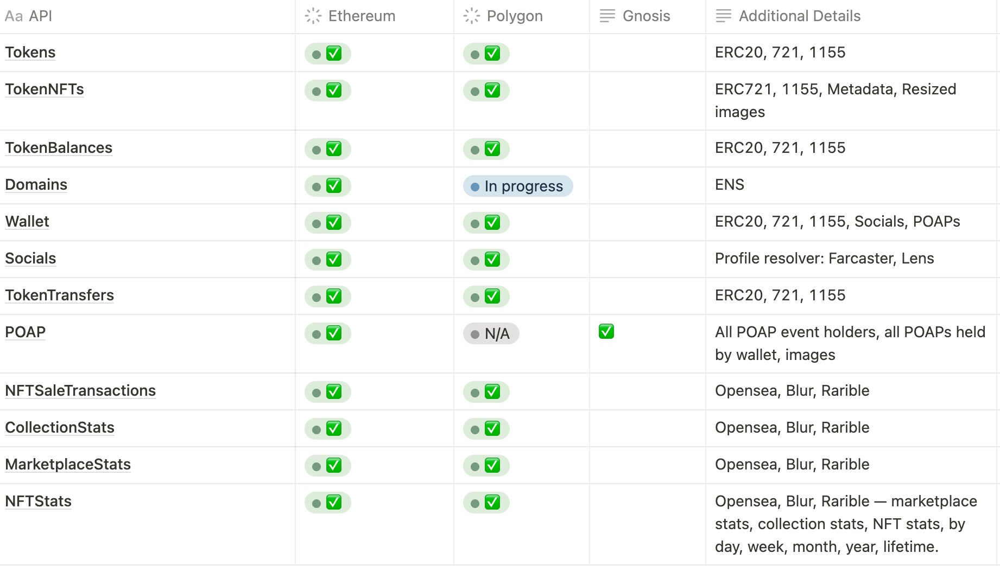

# 🚦 API Status & Roadmap

**Blockchains**

* **Ethereum:** Fully sync'd from genesis block to latest transaction.&#x20;
* **Polygon:** Fully sync'd from genesis block to latest transaction.&#x20;

<figure><figcaption>
Hihg-level API status
</figcaption></figure>

### Availability & Near Term Roadmap of Identity Resolver Functionality\*\*

| Functionality                        | Description                                                               | Availability                         |
| ------------------------------------ | ------------------------------------------------------------------------- | ------------------------------------ |
| **DOMAINS**                          |                                                                           |                                      |
| ENS Resolver                         | Resolve ENS addresses to ENS Names                                        | ✅                                    |
| Primary ENS Resolver                 | Resolve Primary ENS                                                       | ✅                                    |
| ENS Off-chain Resolver               | e.g. [cb.id](http://cb.id)                                                | 28 June, 2023                        |
| Unstoppable Domains                  |                                                                           | July/Aug 2023                        |
|                                      |                                                                           |                                      |
| **FARCASTER**                        |                                                                           |                                      |
| Farcaster Profile Resolver           | Farcaster profiles, addresses, connected addresses, registration details  | ✅                                    |
| Farcaster Profile Resolver from Hubs | Farcaster profiles, addresses, connected addresses, registration details  | July 2023                            |
| Farcaster Follows                    |                                                                           | July 2023                            |
| Farcaster Posts                      |                                                                           | tbd 2023                             |
|                                      |                                                                           |                                      |
| **LENS**                             |                                                                           |                                      |
| Lens Profile Resolver                | Lens username, registration date, connected addresses, etc.               | ✅                                    |
| Lens Follows                         |                                                                           | July 2023                            |
| Lens Collects                        |                                                                           | July 2023                            |
| Lens Posts                           |                                                                           | August 2023                          |
|                                      |                                                                           |                                      |
| **TOKENS & NFTS**                    |                                                                           |                                      |
| NFT Balances                         | User’s NFTS, resized images and metadata, sales history, transfer history | 
Ethereum: Now Polygon: Now
 |
| Token Balances                       | User’s tokens and metadata, sales and transfer history                    | 
Ethereum: Now Polygon: Now
 |
| Token Holders                        | Holders of a token contract: ERC-20, ERC-1155, ERC-721                    | 
Ethereum: Now Polygon: Now
 |
|                                      |                                                                           |                                      |

| **POAPS**       |                                                                                                                                                     |                                                        |
| --------------- | --------------------------------------------------------------------------------------------------------------------------------------------------- | ------------------------------------------------------ |
| POAPS           | 
Holders of POAPS 

POAPS held by users
                                                                                                  | ✅                                                      |
|                 |                                                                                                                                                     |                                                        |
| **XMTP**        |                                                                                                                                                     |                                                        |
| XMTP            | Lookup whether user(s) has XMTP messaging                                                                                                           | July 2023                                              |
|                 |                                                                                                                                                     |                                                        |
| **ADVANCED**    |                                                                                                                                                     |                                                        |
| Snapshots       | 
Holders/holding as of certain date or date range

Length of holding tokens/NFTs
                                                  | 
Polygon end June 2023  Ethereum July 2023
 |
| Aggregations    | Show me who holds X and Y (e.g. Devcon POAP and BAYC, or all Farcaster users who have Farcon and Purple, or all Lens users who attended ETH Lisbon) | v1 30 June, 2023                                       |
|                 |                                                                                                                                                     |                                                        |
| **DEV TOOLING** |                                                                                                                                                     |                                                        |
| Webhooks        |                                                                                                                                                     | July 2023                                              |

\*\* all future dates are subject to change based on team's best analysis of customer priorities

###

### Near-Term Release Plan\*\*

#### **Upcoming Releases — Q2 2023**

* **Snapshots** — e.g. get all tokens held in a date range or length of time -- June
* **Aggregations** e.g. get all addresses that have X and Y -- June/July
* **Price Oracles** - July
* **XMTP** -- July
* **Socials Follows on Lens and Farcaster** -- July
* **Webhooks -** July
* **Ethereum & Polygon base token balances** - August

\*\* all future dates are subject to change
