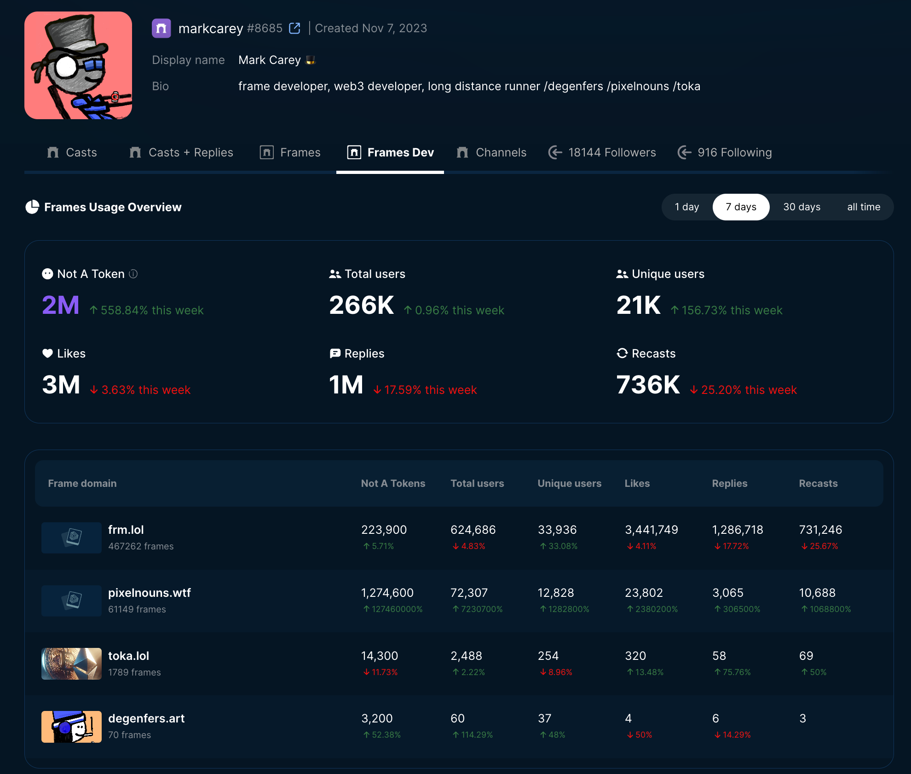

# 📊 Frame Analytics

<figure><figcaption>
Airstack Frame Analytics Preview
</figcaption></figure>

## Features

Airstack's Frame analytics enables you to:

* Consolidate usage data from multiple Frames and cast actions
* Track user engagement on Frames and cast actions at the subdomain level
* Access detailed analytics for individual Frames and cast actions

This feature is available to you for **FREE** and usage is tracked using our Frames Validator.

To integrate our **FREE** Frames Validator into your Frames, make sure that you have your Farcaster account connected to your Airstack account and follow [this tutorial](frames-validator.md) for the step-by-step integration.

## Get Your Frame Analytics


Frame Analytics Tutorial


First, go to airstack.xyz:


Airstack Home Page


Then, click on **Users** and enter your Farcaster fname.

<figure><figcaption>
Airstack Explorer: Search Your Farcaster Fname
</figcaption></figure>

Once your fname appears in the dropdown, click on it and you will be redirected to your user page:

<figure><figcaption>
Airstack Explorer: User Page
</figcaption></figure>

Then, go to the right side of the page, where you can find your Farcaster profile and click on it.

<figure><figcaption>
Airstack Explorer: User Socials
</figcaption></figure>

Once you clicked, you will be redirected to your Farcaster profile page:

<figure><figcaption></figcaption></figure>

In the page, click on **Frames Dev**, and you should be redirected to the Frames analytics page where you can find the complete analytics for all your Frames and cast actions as shown below:

<figure><figcaption>
Airstack Explorer: Frames Analytics
</figcaption></figure>

## Track Detailed Usage Of Specific Frames Domain

In order to get more detailed usage of a specific Frames domain of your interest, simply click on the domain you would like to view:

<figure><figcaption>
Airstack Explorer: List of Frame Domains Tracked By Frame Analytics
</figcaption></figure>

and you will be redirected to a page as shown below with more detailed analytics on individual Frames under the same domain:

<figure><figcaption>
Detailed Usage of degenfers.art Frames
</figcaption></figure>

Here you will find break down of your Frame usage, from number of likes, replies, recasts, and many others.

🎉🥳 Congratulations! You've successfully viewed your Frame analytics and get complete picture of all your Frames & cast actions usages!

## Developer Support

If you have any questions or need help regarding using Airstack Frames Analytics, please join our Airstack's [Telegram](https://t.me/+1k3c2FR7z51mNDRh) group.

## More Resources

* [Frames Validator](frames-validator.md)
* [Airstack Validation API Reference](../../api-references/api-reference/airstack-validation-api.md)
* [Airstack Frames SDK Reference](https://github.com/Airstack-xyz/airstack-frames-sdk)
* [Farcaster Frames Guides](../farcaster/farcaster-frames.md)
