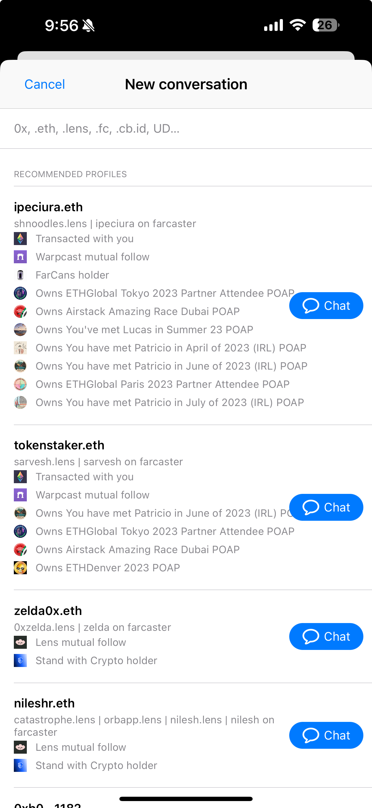

# 💡 Activate Kit for Farcaster Auth Kit

[Farcaster Auth Kit](https://docs.farcaster.xyz/auth-kit/introduction) enables your users to login to your app with their Farcaster custody address. Airstack Activate Kit is the next immediate step.

With Airstack Activate you can immediately fetch all of the user's:

* Registration details from Optimism and Hubs
* Profile details including bio, profile image
* Connected addresses
* Following
* Followers
* Onchain activity (e.g. POAPs, NFTs, tokens)

You can also use Airstack regex search to enable auto-complete search for Farcaster users within your app.

## Table Of Contents

In this guide, you will learn to use [Airstack](https://airstack.xyz) to:

* [Get Farcaster User Details](activate-kit-for-farcaster-auth-kit.md#get-started)
* [Get Farcaster User's Connected Addresses](activate-kit-for-farcaster-auth-kit.md#get-farcaster-users-connected-addresses)
* [Get Farcaster User's Followers and Following Counts](activate-kit-for-farcaster-auth-kit.md#get-farcaster-users-followers-and-following-counts)
* [Get Farcaster User's Followers](activate-kit-for-farcaster-auth-kit.md#get-farcaster-users-followers)
* [Get Farcaster User's Followings](activate-kit-for-farcaster-auth-kit.md#get-farcaster-users-followings)
* [Get All POAPs Attended By Farcaster User](activate-kit-for-farcaster-auth-kit.md#get-all-poaps-attended-by-farcaster-user)
* [Get All NFTs Hold By Farcaster User](activate-kit-for-farcaster-auth-kit.md#get-all-nfts-hold-by-farcaster-user)
* [Get All ERC20 Tokens Hold By Farcaster User](activate-kit-for-farcaster-auth-kit.md#get-all-erc20-tokens-hold-by-farcaster-user)
* [Get Historical NFT Balance of Farcaster User](activate-kit-for-farcaster-auth-kit.md#get-historical-nft-balance-of-farcaster-user)
* [Get Historical ERC20 Token Balance of Farcaster User](activate-kit-for-farcaster-auth-kit.md#get-historical-erc20-token-balance-of-farcaster-user)
* [Get NFT Mints By A Farcaster User](activate-kit-for-farcaster-auth-kit.md#get-nft-mints-by-a-farcaster-user)
* [Get ERC20 Token Mints By A Farcaster User](activate-kit-for-farcaster-auth-kit.md#get-erc20-token-mints-by-a-farcaster-user)
* [Get Token Transfers Sent From A Farcaster User](activate-kit-for-farcaster-auth-kit.md#get-token-transfers-sent-from-a-farcaster-user)
* [Get Token Transfers Received From A Farcaster User](activate-kit-for-farcaster-auth-kit.md#get-token-transfers-received-by-a-farcaster-user)
* [Get All Farcaster Users Whose Names Start With Certain Terms (auto-complete)](activate-kit-for-farcaster-auth-kit.md#get-all-farcaster-users-whose-names-start-with-certain-terms-auto-complete)
* [Get All Farcaster Users Whose Names Contain Certain Terms (auto-complete)](activate-kit-for-farcaster-auth-kit.md#get-all-farcaster-users-whose-names-contain-certain-terms-auto-complete)
* [Get Onchain Graph of Farcaster user](../onchain-graph.md)

### Pre-requisites

* An [Airstack](https://airstack.xyz/) account (free)
* Basic knowledge of GraphQL

### Get Started

**JavaScript/TypeScript/Python**

If you are using JavaScript/TypeScript or Python, Install the Airstack SDK:



**React**

```sh
npm install @airstack/airstack-react
```

**Node**

```sh
npm install @airstack/node
```



**React**

```sh
yarn add @airstack/airstack-react
```

**Node**

```sh
yarn add @airstack/node
```



**React**

```sh
pnpm install @airstack/airstack-react
```

**Node**

```sh
pnpm install @airstack/node
```



```sh
pip install airstack
```



Then, add the following snippets to your code:



```jsx
import { init, useQuery } from "@airstack/airstack-react";

init("YOUR_AIRSTACK_API_KEY");

const query = `YOUR_QUERY`; // Replace with GraphQL Query

const Component = () => {
  const { data, loading, error } = useQuery(query);

  if (data) {
    return <p>Data: {JSON.stringify(data)}</p>;
  }

  if (loading) {
    return <p>Loading...</p>;
  }

  if (error) {
    return <p>Error: {error.message}</p>;
  }
};
```



```javascript
import { init, fetchQuery } from "@airstack/node";

init("YOUR_AIRSTACK_API_KEY");

const query = `YOUR_QUERY`; // Replace with GraphQL Query

const { data, error } = await fetchQuery(query);

console.log("data:", data);
console.log("error:", error);
```



```python
import asyncio
from airstack.execute_query import AirstackClient

api_client = AirstackClient(api_key="YOUR_AIRSTACK_API_KEY")

query = """YOUR_QUERY""" # Replace with GraphQL Query

async def main():
    execute_query_client = api_client.create_execute_query_object(
        query=query)

    query_response = await execute_query_client.execute_query()
    print(query_response.data)

asyncio.run(main())
```



**Other Programming Languages**

To access the Airstack APIs in other languages, you can use [https://api.airstack.xyz/gql](https://api.airstack.xyz/gql) as your GraphQL endpoint.

### **🤖 AI Natural Language**[**​**](https://xmtp.org/docs/tutorials/query-xmtp#-ai-natural-language)

[Airstack](https://airstack.xyz/) provides an AI solution for you to build GraphQL queries to fulfill your use case easily. You can find the AI prompt of each query in the demo's caption or title for yourself to try.

<figure><figcaption><p>Airstack AI (Demo)</p></figcaption></figure>

## Get Farcaster User Details

You can fetch the Farcaster user details of a 0x address by using the [`Socials`](../../api-references/api-reference/socials-api.md) API and provide the 0x address to the `identity` filter input:

### Try Demo


Show me Farcaster user details of Farcaster profile owned by 0x182327170fC284cAaA5b1bC3e3878233f529D741


### Code



```graphql
query MyQuery {
  Socials(
    input: {
      filter: {
        identity: {_eq: "0x182327170fC284cAaA5b1bC3e3878233f529D741"},
        dappName: {_eq: farcaster}
      },
      blockchain: ethereum,
      limit: 200
    }
  ) {
    Social {
      profileName
      fnames
      userId
      profileImage
      profileImageContentValue {
        image {
          medium
        }
      }
    }
  }
}
```



```json
{
  "data": {
    "Socials": {
      "Social": [
        {
          "profileName": "v",
          "fnames": [
            "v",
            "varunsrin.eth"
          ],
          "userId": "2",
          "profileImage": "https://i.seadn.io/gae/sYAr036bd0bRpj7OX6B-F-MqLGznVkK3--DSneL_BT5GX4NZJ3Zu91PgjpD9-xuVJtHq0qirJfPZeMKrahz8Us2Tj_X8qdNPYC-imqs?w=500&auto=format",
          "profileImageContentValue": {
            "image": {
              "medium": "https://assets.airstack.xyz/image/social/XCPJH5EP49qftYc7+wAFfv5jzo3ddBWc9FMEERWezG8=/medium.png"
            }
          }
        }
      ]
    }
  }
}
```



## Get Farcaster User's Connected Addresses

You can fetch the Farcaster profile's connected addresses of a 0x address by using the [`Socials`](../../api-references/api-reference/socials-api.md) API and provide the 0x address to the `identity` filter input and all the connected addresses will be returned in the `userAssociatedAddresses` field:

### Try Demo


Show me all the connected addresses of Farcaster profile owned by 0x182327170fC284cAaA5b1bC3e3878233f529D741


### Code



```graphql
query MyQuery {
  Socials(
    input: {
      filter: {
        identity: {_eq: "0x182327170fC284cAaA5b1bC3e3878233f529D741"},
        dappName: {_eq: farcaster}
      },
      blockchain: ethereum,
      limit: 200
    }
  ) {
    Social {
      userAssociatedAddresses
    }
  }
}
```



```json
{
  "data": {
    "Socials": {
      "Social": [
        {
          "userAssociatedAddresses": [
            "0x4114e33eb831858649ea3702e1c9a2db3f626446",
            "0x91031dcfdea024b4d51e775486111d2b2a715871",
            "0x182327170fc284caaa5b1bc3e3878233f529d741"
          ]
        }
      ]
    }
  }
}
```



## Get Farcaster User's Followers and Following Counts

You can fetch the Farcaster profile's connected addresses of a 0x address by using the [`Socials`](../../api-references/api-reference/socials-api.md) API and provide the 0x address to the `identity` filter input.

The number of people following and people followed by the given Farcaster profile will be returned in the `followerCount` and `followingCount`, respectively:

### Try Demo


Show me the number of followers and followings of 0x182327170fC284cAaA5b1bC3e3878233f529D741 on Farcaster


### Code



```graphql
query MyQuery {
  Socials(
    input: {
      filter: {
        identity: {_eq: "0x182327170fC284cAaA5b1bC3e3878233f529D741"},
        dappName: {_eq: farcaster}
      },
      blockchain: ethereum,
      limit: 200
    }
  ) {
    Social {
      followerCount
      followingCount
    }
  }
}
```



```json
{
  "data": {
    "Socials": {
      "Social": [
        {
          "followerCount": 37149,
          "followingCount": 1000
        }
      ]
    }
  }
}
```



## Get Farcaster User's Followers

You can fetch all the users following 0x address on Farcaster by using the [`SocialFollowers`](../../api-references/api-reference/socialfollowers-api.md) API and provide the 0x address to the `identity` filter input:

### Try Demo


Show me Farcaster followers of 0x182327170fC284cAaA5b1bC3e3878233f529D741


### Code



```graphql
query MyQuery {
  SocialFollowers(
    input: {
      filter: {
        dappName: { _eq: farcaster }
        identity: {_eq: "0x182327170fC284cAaA5b1bC3e3878233f529D741"}
      }
      blockchain: ALL
      limit: 200
    }
  ) {
    Follower {
      followerAddress {
        addresses
        socials(input: { filter: { dappName: { _eq: farcaster } } }) {
          profileName
          userId
        }
      }
    }
  }
}
```



```json
{
  "data": {
    "SocialFollowers": {
      "Follower": [
        {
          "followerAddress": {
            "addresses": [
              "0xf86365d15b374a28c453396af7e10af24fae1b04"
            ],
            "socials": [
              {
                "profileName": "aresangel",
                "userId": "214577"
              }
            ]
          }
        },
        {
          "followerAddress": {
            "addresses": [
              "0x9ad6bf4108b79057c0ccc70521c86feca540f24f"
            ],
            "socials": [
              {
                "profileName": "tortula",
                "userId": "193061"
              }
            ]
          }
        },
        // More users following 0x182327170fC284cAaA5b1bC3e3878233f529D741 on Farcaster
      ]
    }
  }
}
```



## Get Farcaster User's Followings

You can fetch all the users being followed by 0x address on Farcaster by using the [`SocialFollowings`](../../api-references/api-reference/socialfollowings-api.md) API and provide the 0x address to the `identity` filter input:

### Try Demo


Show me Farcaster following of 0x182327170fC284cAaA5b1bC3e3878233f529D741


### Code



```graphql
query MyQuery {
  SocialFollowings(
    input: {
      filter: {
        dappName: { _eq: farcaster }
        identity: {_eq: "0x182327170fC284cAaA5b1bC3e3878233f529D741"}
      }
      blockchain: ALL
      limit: 200
    }
  ) {
    Following {
      followingAddress {
        addresses
        socials(input: { filter: { dappName: { _eq: farcaster } } }) {
          profileName
          userId
        }
      }
    }
  }
}
```



```json
{
  "data": {
    "SocialFollowings": {
      "Following": [
        {
          "followingAddress": {
            "addresses": [
              "0x7244b3a5726f5f11d6fb9414ea98d8ce9f10c88a",
              "0x6ca011aae6d551a3efa533c40c24a810321c0384"
            ],
            "socials": [
              {
                "profileName": "adeets-22",
                "userId": "323"
              }
            ]
          }
        },
        {
          "followingAddress": {
            "addresses": [
              "0x66bd69c7064d35d146ca78e6b186e57679fba249",
              "0xeaf55242a90bb3289db8184772b0b98562053559"
            ],
            "socials": [
              {
                "profileName": "betashop.eth",
                "userId": "602"
              }
            ]
          }
        },
        // More users followed on Farcaster by 0x182327170fC284cAaA5b1bC3e3878233f529D741
      ]
    }
  }
}
```



## Get All POAPs Attended By Farcaster User

You can fetch all POAPs owned by a Farcaster user using the [`Poaps`](../../api-references/api-reference/poaps-api.md) API and providing the Farcaster user's address to the `owner` filter:

### Try Demo


Show POAPs owned by Farcaster user with address 0xD7029BDEa1c17493893AAfE29AAD69EF892B8ff2


### Code



```graphql
query POAPsOwnedByFarcasterUser {
  Poaps(
    input: {
      filter: {
        owner: {_eq: "0xD7029BDEa1c17493893AAfE29AAD69EF892B8ff2"}
      }
      blockchain: ALL
      limit: 200
    }
  ) {
    Poap {
      eventId
      poapEvent {
        eventName
        eventURL
        startDate
        endDate
        country
        city
        contentValue {
          image {
            extraSmall
            large
            medium
            original
            small
          }
        }
      }
    }
  }
}
```



```json
{
  "data": {
    "Poaps": {
      "Poap": [
        {
          "eventId": "6584",
          "poapEvent": {
            "eventName": "Pudgy Penguin owner as of August 2021",
            "eventURL": "https://www.stonercats.com/",
            "startDate": "2021-08-30T00:00:00Z",
            "endDate": "2021-09-30T00:00:00Z",
            "country": "United States",
            "city": "Ethereum",
            "contentValue": {
              "image": {
                "extraSmall": "https://assets.airstack.xyz/image/poap/100/6584/extra_small.png",
                "large": "https://assets.airstack.xyz/image/poap/100/6584/large.png",
                "medium": "https://assets.airstack.xyz/image/poap/100/6584/medium.png",
                "original": "https://assets.airstack.xyz/image/poap/100/6584/original_image.png",
                "small": "https://assets.airstack.xyz/image/poap/100/6584/small.png"
              }
            }
          }
        },
        {
          "eventId": "14498",
          "poapEvent": {
            "eventName": "ConstitutionDAO Contributor",
            "eventURL": "https://www.constitutiondao.com/",
            "startDate": "2021-11-18T00:00:00Z",
            "endDate": "2021-11-18T00:00:00Z",
            "country": "",
            "city": "",
            "contentValue": {
              "image": {
                "extraSmall": "https://assets.airstack.xyz/image/poap/1/14498/extra_small.png",
                "large": "https://assets.airstack.xyz/image/poap/1/14498/large.png",
                "medium": "https://assets.airstack.xyz/image/poap/1/14498/medium.png",
                "original": "https://assets.airstack.xyz/image/poap/1/14498/original_image.png",
                "small": "https://assets.airstack.xyz/image/poap/1/14498/small.png"
              }
            }
          }
        },
        {
          "eventId": "6481",
          "poapEvent": {
            "eventName": "Fractional Early Adopter",
            "eventURL": "https://fractional.art/",
            "startDate": "2021-08-27T00:00:00Z",
            "endDate": "2021-08-27T00:00:00Z",
            "country": "",
            "city": "",
            "contentValue": {
              "image": {
                "extraSmall": "https://assets.airstack.xyz/image/poap/1/6481/extra_small.png",
                "large": "https://assets.airstack.xyz/image/poap/1/6481/large.png",
                "medium": "https://assets.airstack.xyz/image/poap/1/6481/medium.png",
                "original": "https://assets.airstack.xyz/image/poap/1/6481/original_image.png",
                "small": "https://assets.airstack.xyz/image/poap/1/6481/small.png"
              }
            }
          }
        },
        // Other POAPs owned by 0xD7029BDEa1c17493893AAfE29AAD69EF892B8ff2
      ]
    }
  }
}
```



## Get All NFTs Hold By Farcaster User

You can fetch all NFTs owned by a Farcaster user using the [`TokenBalances`](../../api-references/api-reference/tokenbalances-api.md) API and providing the Farcaster user's address to the `owner` filter:


For fetching NFT balances data from multiple chains, check out [Cross-Chain Queries](../basics/cross-chain-queries.md).


### Try Demo


Show NFT on Ethereum owned by farcaster user with address 0xD7029BDEa1c17493893AAfE29AAD69EF892B8ff2


### Code



```graphql
query NFTsOwnedByFarcasterUser {
  TokenBalances(
    input: {
      filter: {
        owner: {_eq: "0xD7029BDEa1c17493893AAfE29AAD69EF892B8ff2"}
        tokenType: { _in: [ERC1155, ERC721] }
      }
      blockchain: ethereum
      limit: 200
    }
  ) {
    TokenBalance {
      amount
      tokenAddress
      tokenId
      tokenType
      tokenNfts {
        contentValue {
          image {
            extraSmall
            small
            medium
            large
          }
        }
      }
    }
  }
}
```



```json
{
  "data": {
    "TokenBalances": {
      "TokenBalance": [
        {
          "owner": {
            "socials": [
              {
                "profileName": "dwr.eth",
                "userId": "3",
                "userAssociatedAddresses": [
                  "0x74232bf61e994655592747e20bdf6fa9b9476f79",
                  "0xb877f7bb52d28f06e60f557c00a56225124b357f",
                  "0xa14b4c95b5247199d74c5578531b4887ca5e4909",
                  "0xd7029bdea1c17493893aafe29aad69ef892b8ff2"
                ]
              }
            ]
          },
          "amount": "1",
          "tokenAddress": "0x1538c5ddbb073638b7cd1ae41ec2d9f9a4c24a7e",
          "tokenId": "1",
          "tokenType": "ERC721",
          "tokenNfts": {
            "contentValue": {
              "image": {
                "extraSmall": "https://assets.airstack.xyz/image/nft/1/0x1538c5ddbb073638b7cd1ae41ec2d9f9a4c24a7e/1/extra_small.jpg",
                "small": "https://assets.airstack.xyz/image/nft/1/0x1538c5ddbb073638b7cd1ae41ec2d9f9a4c24a7e/1/small.jpg",
                "medium": "https://assets.airstack.xyz/image/nft/1/0x1538c5ddbb073638b7cd1ae41ec2d9f9a4c24a7e/1/medium.jpg",
                "large": "https://assets.airstack.xyz/image/nft/1/0x1538c5ddbb073638b7cd1ae41ec2d9f9a4c24a7e/1/large.jpg"
              }
            }
          }
        }
        // Other Ethereum NFTs
      ],
      "pageInfo": {
        "nextCursor": "eyJMYXN0VmFsdWVzTWFwIjp7Il9pZCI6eyJWYWx1ZSI6IjEweGJkODI0MGMyM2VjOThiMjFmMzhjNWQzZTFlZWE5NTdhYjgwZGE5Y2EweGQ3MDI5YmRlYTFjMTc0OTM4OTNhYWZlMjlhYWQ2OWVmODkyYjhmZjIiLCJEYXRhVHlwZSI6InN0cmluZyJ9LCJsYXN0VXBkYXRlZFRpbWVzdGFtcCI6eyJWYWx1ZSI6IjE2NDc1MjIyNDYiLCJEYXRhVHlwZSI6IkRhdGVUaW1lIn19LCJQYWdpbmF0aW9uRGlyZWN0aW9uIjoiTkVYVCJ9",
        "prevCursor": ""
      }
    }
  }
}
```



## Get All ERC20 Tokens Hold By Farcaster User

You can fetch all ERC20 tokens owned by a Farcaster user using the [`TokenBalances`](../../api-references/api-reference/tokenbalances-api.md) API and providing the Farcaster user's address to the `owner` filter:


For fetching ERC20 token balances data from multiple chains, check out [Cross-Chain Queries](../basics/cross-chain-queries.md).


### Try Demo


Show ERC20 tokens on Ethereum owned by Farcaster user with address 0xD7029BDEa1c17493893AAfE29AAD69EF892B8ff2


### Code



<pre class="language-graphql"><code class="lang-graphql">query ERC20sOwnedByFarcasterUser {
  TokenBalances(
    input: {
      filter: {
        # Farcaster user's address
<strong>        owner: { _eq: "0xD7029BDEa1c17493893AAfE29AAD69EF892B8ff2" }
</strong>        tokenType: { _eq: ERC20 }
      }
      blockchain: ethereum
      limit: 200
    }
  ) {
    TokenBalance {
      amount
      tokenAddress
      token {
        name
        symbol
      }
    }
  }
}
</code></pre>



```json
{
  "data": {
    "TokenBalances": {
      "TokenBalance": [
        {
          "amount": "1180000000000000000000",
          "tokenAddress": "0xd7c1eb0fe4a30d3b2a846c04aa6300888f087a5f",
          "token": {
            "name": "POINTS",
            "symbol": "POINTS"
          }
        },
        {
          "amount": "1700000",
          "tokenAddress": "0x86c65d382e8980bcd9ef529add67e1f70efe6a47",
          "token": {
            "name": "$ LiquidEther.net",
            "symbol": "Visit LiquidEther.net to claim rewards"
          }
        },
        {
          "amount": "151869896",
          "tokenAddress": "0xa0b86991c6218b36c1d19d4a2e9eb0ce3606eb48",
          "token": {
            "name": "USD Coin",
            "symbol": "USDC"
          }
        },
        // Other Ethereum ERC20s owned by 0xD7029BDEa1c17493893AAfE29AAD69EF892B8ff2
      ],
    }
  }
}
```



## Get Historical NFT Balance of Farcaster User

You can fetch Farcaster user's historical NFT balances and their time series data at a specified time by using [`Snapshots`](../../api-references/api-reference/snapshots-api.md) API and providing the given Farcaster user's 0x address to the `owner` input and specifying `tokenType` with the token type `ERC721` and `ERC1155`:


For fetching historical NFT balances data from multiple chains, check out [Cross-Chain Queries](../basics/cross-chain-queries.md).


### Try Demo


Show me Farcaster user with address 0xD7029BDEa1c17493893AAfE29AAD69EF892B8ff2 historical ERC20 balance on Aug 18, 2023


### Code



<pre class="language-graphql"><code class="lang-graphql">query MyQuery {
  Snapshots(
    input: {
      filter: {
        owner: {
          _eq: "0xD7029BDEa1c17493893AAfE29AAD69EF892B8ff2"
        },
<strong>        date: {_eq: "2023-08-18"} # Specifying date to Aug 18, 2023
</strong>        tokenType: {_in: [ERC721, ERC1155]}
      },
      blockchain: ethereum,
      limit: 200
    }
  ) {
    Snapshot {
      tokenAddress
      tokenId
      tokenType
      token {
        name
        symbol
        isSpam
      }
      tokenNft {
        contentValue {
          image {
            extraSmall
            large
            medium
            original
            small
          }
        }
      }
      startBlockNumber
      startBlockTimestamp
      endBlockNumber
      endBlockTimestamp
    }
  }
}
</code></pre>



<pre class="language-json"><code class="lang-json">{
  "data": {
    "Snapshots": {
      "Snapshot": [
        {
          "tokenAddress": "0x2dec96736e7d24e382e25d386457f490ae64889e",
          "tokenId": "1570",
          "tokenType": "ERC721",
          "token": {
            "name": "Peacefall",
            "symbol": "PF",
            "isSpam": false
          },
          "tokenNft": {
            "contentValue": {
              "image": {
                "extraSmall": "https://assets.airstack.xyz/image/nft/pL4M7vP0WKi6EzxauXahZ3bnHOWqaDGo1gQv53MH7J/WW6v19vhKaQ9tTSsZS9nzP9ipEmB0+c+aeAlAf9RGMA==/extra_small.gif",
                "large": "https://assets.airstack.xyz/image/nft/pL4M7vP0WKi6EzxauXahZ3bnHOWqaDGo1gQv53MH7J/WW6v19vhKaQ9tTSsZS9nzP9ipEmB0+c+aeAlAf9RGMA==/large.gif",
                "medium": "https://assets.airstack.xyz/image/nft/pL4M7vP0WKi6EzxauXahZ3bnHOWqaDGo1gQv53MH7J/WW6v19vhKaQ9tTSsZS9nzP9ipEmB0+c+aeAlAf9RGMA==/medium.gif",
                "original": "https://assets.airstack.xyz/image/nft/pL4M7vP0WKi6EzxauXahZ3bnHOWqaDGo1gQv53MH7J/WW6v19vhKaQ9tTSsZS9nzP9ipEmB0+c+aeAlAf9RGMA==/original_image.gif",
                "small": "https://assets.airstack.xyz/image/nft/pL4M7vP0WKi6EzxauXahZ3bnHOWqaDGo1gQv53MH7J/WW6v19vhKaQ9tTSsZS9nzP9ipEmB0+c+aeAlAf9RGMA==/small.gif"
              }
            }
          },
          "startBlockNumber": 14450519,
          "startBlockTimestamp": "2022-03-24T18:12:38Z",
<strong>          "endBlockNumber": -1, // -1 implies that the token is no longer held
</strong>          "endBlockTimestamp": "2024-01-15T15:42:14Z"
        },
        // Other historical Ethereum NFT balances ever held
      ]
    }
  }
}
</code></pre>



## Get Historical ERC20 Token Balance of Farcaster User

You can fetch Farcaster user's historical ERC20 token balances and their time series data at a specified time by using [`Snapshots`](../../api-references/api-reference/snapshots-api.md) API and providing the given Farcaster user's 0x address to the `owner` input and specifying `tokenType` with the token type `ERC20`:


For fetching historical ERC20 token balances data from multiple chains, check out [Cross-Chain Queries](../basics/cross-chain-queries.md).


### Try Demo


Show me Farcaster user with address 0xD7029BDEa1c17493893AAfE29AAD69EF892B8ff2 historical ERC20 balance on Aug 18, 2023


### Code



<pre class="language-graphql"><code class="lang-graphql">query MyQuery {
  Snapshots(
    input: {
      filter: {
        owner: {
          _eq: "0xD7029BDEa1c17493893AAfE29AAD69EF892B8ff2"
        },
<strong>        date: {_eq: "2023-08-18"} # Specifying date to Aug 18, 2023
</strong>        tokenType: {_in: [ERC20]}
      },
      blockchain: ethereum,
      limit: 200
    }
  ) {
    Snapshot {
      tokenAddress
      token {
        name
        symbol
        isSpam
      }
      startBlockNumber
      startBlockTimestamp
      endBlockNumber
      endBlockTimestamp
    }
  }
}
</code></pre>



<pre class="language-json"><code class="lang-json">{
  "data": {
    "Snapshots": {
      "Snapshot": [
        {
          "tokenAddress": "0x3ebd76b25a453252ca6b61334ed6f156bf5dd928",
          "token": {
            "name": "pudgy.looksrare.team",
            "symbol": "pudgy.looksrare.team",
            "isSpam": false
          },
          "startBlockNumber": 15566321,
          "startBlockTimestamp": "2022-09-19T08:17:35Z",
<strong>          "endBlockNumber": -1, // -1 implies that the token is no longer held
</strong>          "endBlockTimestamp": "2024-01-15T15:37:28Z"
        },
        {
          "tokenAddress": "0xd13017c013ae2eb708c4fcdb70b20d16ba3b64a9",
          "token": {
            "name": "os20.io",
            "symbol": "Opensea",
            "isSpam": false
          },
          "startBlockNumber": 15675664,
          "startBlockTimestamp": "2022-10-04T15:28:47Z",
<strong>          "endBlockNumber": -1, // -1 implies that the token is no longer held
</strong>          "endBlockTimestamp": "2024-01-15T15:37:28Z"
        },
        // Other historical Ethereum ERC20 token balances ever held
      ],
    }
  }
}
</code></pre>



## Get NFT Mints By A Farcaster User

You can fetch all NFTs minted by a Farcaster user across multiple chains, such as Ethereum, Polygon, and Base, by using the [`TokenTransfers`](../../api-references/api-reference/tokentransfers-api.md) API:


For fetching NFT mints data from multiple chains, check out [Cross-Chain Queries](../basics/cross-chain-queries.md).


### Try Demo


Show me all NFTs minted by a Farcaster user with address 0xeaf55242a90bb3289dB8184772b0B98562053559 on Ethereum


### Code



<pre class="language-graphql"><code class="lang-graphql">query MyQuery {
  TokenTransfers(
    input: {
      filter: {
        # Only get mints that are executed by the same Farcaster user
<strong>        operator: {_eq: "0xeaf55242a90bb3289dB8184772b0B98562053559"},
</strong>        # Mints are token transfers that has null address as `from`
<strong>        from: {_eq: "0x0000000000000000000000000000000000000000"},
</strong>        # Set this to the Farcaster user that receive the token mints
<strong>        to: {_eq: "0xeaf55242a90bb3289dB8184772b0B98562053559"},
</strong>        # Get only NFTs (ERC721/1155)
<strong>        tokenType: {_in: [ERC721, ERC1155]},
</strong>      },
      blockchain: ethereum,
      order: {blockTimestamp: DESC}
    }
  ) {
    TokenTransfer {
      blockchain
      formattedAmount
      tokenAddress
      tokenId
      tokenNft {
        metaData {
          name
        }
        contentValue {
          image {
            medium
          }
        }
      }
      tokenType
    }
  }
}
</code></pre>



```json
{
  "data": {
    "TokenTransfers": {
      "TokenTransfer": [
        {
          "blockchain": "ethereum",
          "formattedAmount": 1,
          "tokenAddress": "0x0f92612c5f539c89dc379e8aa42e3ba862a34b7e",
          "tokenId": "8",
          "tokenNft": {
            "metaData": {
              "name": "Venture Club Alpha Membership NFT"
            },
            "contentValue": {
              "image": {
                "medium": "https://assets.uat.airstack.xyz/image/nft/li5d4XIGDPxtahI+EMjNmOiSymdFmCR0OsRC2p13nDaZQijmEYVpYlbV0t57GD8K/medium.jpg"
              }
            }
          },
          "tokenType": "ERC721"
        },
        // Other Ethereum NFTs minted by 0xeaf55242a90bb3289dB8184772b0B98562053559
      ]
    },
  }
}
```



## Get ERC20 Token Mints By A Farcaster User

You can fetch all ERC20 tokens minted by a Farcaster user across multiple chains, such as Ethereum, Polygon, and Base, by using the [`TokenTransfers`](../../api-references/api-reference/tokentransfers-api.md) API:


For fetching ERC20 mints data from multiple chains, check out [Cross-Chain Queries](../basics/cross-chain-queries.md).


### Try Demo


Show me all ERC20 tokens minted by Farcaster user with address 0xB59Aa5Bb9270d44be3fA9b6D67520a2d28CF80AB on Polygon


### Code



<pre class="language-graphql"><code class="lang-graphql">query MyQuery {
  TokenTransfers(
    input: {
      filter: {
        # Only get mints that are executed by the same Farcaster user
<strong>        operator: {_eq: "0xB59Aa5Bb9270d44be3fA9b6D67520a2d28CF80AB"},
</strong>        # Mints are token transfers that has null address as `from`
<strong>        from: {_eq: "0x0000000000000000000000000000000000000000"},
</strong>        # Set this to the Farcaster user that receive the token mints
<strong>        to: {_eq: "0xB59Aa5Bb9270d44be3fA9b6D67520a2d28CF80AB"},
</strong>        # Get only ERC20 tokens
<strong>        tokenType: {_eq: ERC20},
</strong>      },
      blockchain: polygon,
      order: {blockTimestamp: DESC}
    }
  ) {
    TokenTransfer {
      blockchain
      formattedAmount
      tokenAddress
      token {
        name
      }
    }
  }
}
</code></pre>



```json
{
  "data": {
    "TokenTransfers": {
      "TokenTransfer": [
        {
          "blockchain": "polygon",
          "formattedAmount": 0.01697896348647009,
          "tokenAddress": "0xadbf1854e5883eb8aa7baf50705338739e558e5b",
          "token": {
            "name": "Uniswap V2"
          }
        },
        // Other ERC20 tokens minted by ipeciura.eth on Polygon
      ]
    }
  }
}
```



## Get Token Transfers Sent From A Farcaster User

You can fetch all token transfers sent by a given Farcaster user across multiple chains, such as Ethereum, Polygon, and Base, by using the [`TokenTransfers`](../../api-references/api-reference/tokentransfers-api.md) API:


For fetching token transfers data sent from a Farcaster user from multiple chains, check out [Cross-Chain Queries](../basics/cross-chain-queries.md).


### Try Demo


Show me token transfers sent from Farcaster usre with address 0xeaf55242a90bb3289dB8184772b0B98562053559 on Ethereum


### Code



<pre class="language-graphql"><code class="lang-graphql">query GetTokenTransfers {
  TokenTransfers(
    input: {
      filter: {
        # Only get token transfers from 0xeaf55242a90bb3289dB8184772b0B98562053559
<strong>        from: {_eq: "0xeaf55242a90bb3289dB8184772b0B98562053559"},
</strong>        # Only get token transfers with non-zero amount
<strong>        formattedAmount: {_gt: 0},
</strong>        # Remove all minting/burning + self-transfer
<strong>        _nor: {
</strong>          from: {
            _in: [
              "0x0000000000000000000000000000000000000000",
              "0x000000000000000000000000000000000000dEaD"
            ]
          },
          to: {
            _in: [
              "0x0000000000000000000000000000000000000000",
              "0x000000000000000000000000000000000000dEaD",
              "0xeaf55242a90bb3289dB8184772b0B98562053559"
            ]
          }
        }
      },
      blockchain: ethereum,
      limit: 50
    }
  ) {
    TokenTransfer {
      formattedAmount
      tokenType
      token {
        name
      }
    }
  }
}
</code></pre>



```json
{
  "data": {
    "TokenTransfers": {
      "TokenTransfer": [
        {
          "formattedAmount": 25,
          "tokenType": "ERC20",
          "token": {
            "name": "USD Coin"
          },
        },
        {
          "formattedAmount": 25,
          "tokenType": "ERC20",
          "token": {
            "name": "USD Coin"
          },
        },
        // Other token transfers from 0xeaf55242a90bb3289dB8184772b0B98562053559 on Ethereum
      ]
    }
  }
}
```



## Get Token Transfers Received By A Farcaster User

You can fetch all token transfers received by a given Farcaster user across multiple chains, such as Ethereum, Polygon, and Base, by using the [`TokenTransfers`](../../api-references/api-reference/tokentransfers-api.md) API:


For fetching token transfers data received by a Farcaster user from multiple chains, check out [Cross-Chain Queries](../basics/cross-chain-queries.md).


### Try Demo


Show me all token transfers received by 0xeaf55242a90bb3289dB8184772b0B98562053559 on Ethereum


### Code



<pre class="language-graphql"><code class="lang-graphql">query GetTokenTransfers {
  TokenTransfers(
    input: {
      filter: {
        # Only get token transfers to 0xeaf55242a90bb3289dB8184772b0B98562053559
<strong>        to: {_eq: "0xeaf55242a90bb3289dB8184772b0B98562053559"},
</strong>        # Only get token transfers with non-zero amount
<strong>        formattedAmount: {_gt: 0},
</strong>        # Remove all minting/burning + self-transfer
<strong>        _nor: {
</strong>          from: {
            _in: [
              "0x0000000000000000000000000000000000000000",
              "0x000000000000000000000000000000000000dEaD",
              "0xeaf55242a90bb3289dB8184772b0B98562053559"
            ]
          },
          to: {
            _in: [
              "0x0000000000000000000000000000000000000000",
              "0x000000000000000000000000000000000000dEaD"
            ]
          }
        }
      },
      blockchain: ethereum,
      limit: 50
    }
  ) {
    TokenTransfer {
      formattedAmount
      tokenType
      token {
        name
      }
    }
  }
}
</code></pre>



```json
{
  "data": {
    "TokenTransfers": {
      "TokenTransfer": [
        {
          "formattedAmount": 1,
          "tokenType": "ERC721",
          "token": {
            "name": "ETHGlobal Pragma Lisbon"
          },
        },
        {
          "formattedAmount": 0.00005,
          "tokenType": "ERC20",
          "token": {
            "name": "Wrapped Ether"
          },
        },
        // Other Token Transfers received by 0xeaf55242a90bb3289dB8184772b0B98562053559 on Ethereum
      ]
    }
  }
}
```



## Get All Farcaster Users Whose Names Start With Certain Terms (auto-complete)

You can fetch all Farcaster users that starts with given words by providing the regex pattern `"^<given-words>"` to the <mark style="color:red;">**`_regex`**</mark> operator in [`Socials`](../../api-references/api-reference/socials-api.md) API:

### Try Demo


show me all Farcaster users starting with "a"


### Code



<pre class="language-graphql"><code class="lang-graphql">query MyQuery {
  Socials(
    input: {
      filter: {
        # This regex pattern will search all Farcaster users
        # starting with "a"
<strong>        profileName: {_regex: "^a"},
</strong>        dappName: {_eq: farcaster}
      },
      blockchain: ethereum
    }
  ) {
    Social {
      dappName
      profileName
    }
  }
}
</code></pre>



```json
{
  "data": {
    "Socials": {
      "Social": [
        {
          "dappName": "farcaster",
          "profileName": "atty"
        },
        {
          "dappName": "farcaster",
          "profileName": "anita-mpf"
        },
        {
          "dappName": "farcaster",
          "profileName": "amarraghu"
        },
        // Other Farcaster users starting with "a"
      ]
    }
  }
}
```



## Get All Farcaster Users Whose Names Contain Certain Terms (auto-complete)

You can fetch all Farcaster users that contains given words by providing `"<given-words>"` directly to the <mark style="color:red;">**`_regex`**</mark> operator in [`Socials`](../../api-references/api-reference/socials-api.md) API:

### Try Demo


show me all Farcaster users containing with "abc"


### Code



<pre class="language-graphql"><code class="lang-graphql">query MyQuery {
  Socials(
    input: {
      filter: {
        # This regex pattern will search all Farcaster users
        # containing "abc"
<strong>        profileName: {_regex: "abc"},
</strong>        dappName: {_eq: farcaster}
      },
      blockchain: ethereum
    }
  ) {
    Social {
      dappName
      profileName
    }
  }
}
</code></pre>



```json
{
  "data": {
    "Socials": {
      "Social": [
        {
          "dappName": "farcaster",
          "profileName": "abcabc"
        },
        {
          "dappName": "farcaster",
          "profileName": "krabchinski"
        },
        {
          "dappName": "farcaster",
          "profileName": "861213abcc"
        },
        // Other Farcaster users containing with "abc"
      ]
    }
  }
}
```



## Next Steps

To further enrich and improve the user experience for your Farcaster application, you can use Airstack to fetch a user's onchain contacts, which will provide all the users that have onchain connection to you, e.g. Farcaster followers/following, attended the same POAP events, holder of the same token, etc.

<div align="center">

<figure><figcaption><p>Builder.fi's Onchain Contacts</p></figcaption></figure>

 

<figure><figcaption><p>Converse's Onchain Contacts</p></figcaption></figure>

</div>

To learn more how to build this into your application, check out [Onchain Graph](../onchain-graph.md) and [Onchain Contacts](../onchain-contacts.md).

## Developer Support

If you have any questions or need help regarding the activate kit for [Farcaster Auth Kit](https://docs.farcaster.xyz/auth-kit/introduction), please join our Airstack's [Telegram](https://t.me/+1k3c2FR7z51mNDRh) group.

## More Resources

* [Onchain Graph Guides](../onchain-graph.md)
* [Onchain Contact Guides](../onchain-contacts.md)
* [Search Farcaster Users](search-farcaster-users.md)
* [Farcaster Followers](farcaster-followers.md)
* [Farcaster Following](farcaster-following.md)
* [Get Token Balances](../lens/get-token-balances.md)
* [Token Mints](../token-mints.md)
* [Token Transfers](../recommendation-engine/token-transfers.md)
* [Balance Snapshots](../balance-snapshots.md)
* [Socials API Reference](../../api-references/api-reference/socials-api.md)
* [SocialFollowers API Reference](../../api-references/api-reference/socialfollowers-api.md)
* [SocialFollowings API Reference](../../api-references/api-reference/socialfollowings-api.md)
* [TokenBalances API Reference](../../api-references/api-reference/tokenbalances-api.md)
* [Snapshots API Reference](../../api-references/api-reference/snapshots-api.md)
