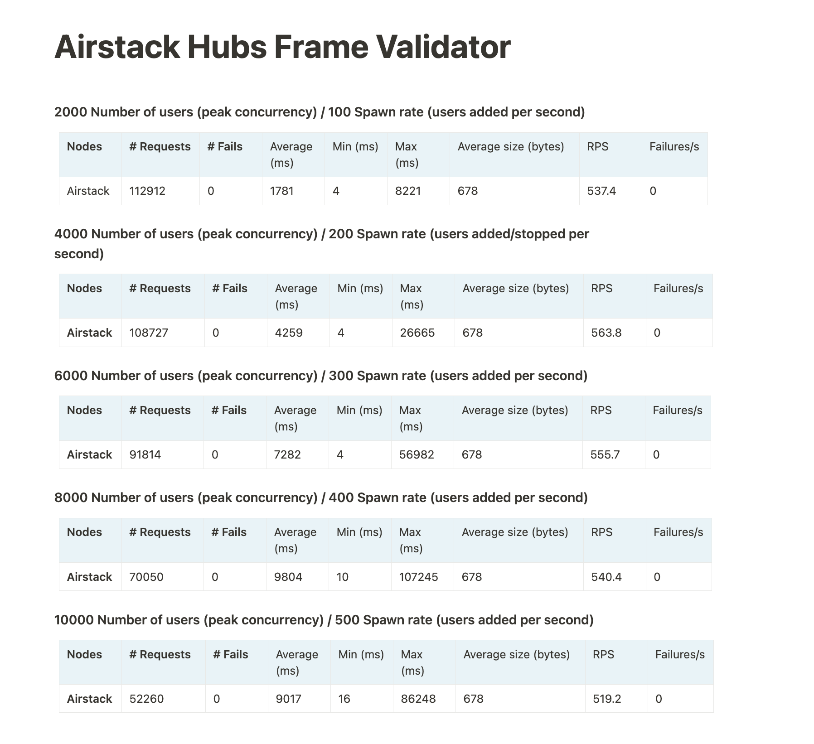

# 🧹 Spam Filters

In this tutorial we'll demonstrate how to create a split inbox that filters senders into \
Primary, General, and Requests. \
\
**Primary** = people that you know

**General** = people you may know and who are unlikely to be spam

**Requests** = unknown and suspect senders, which can also be split further into a 4th bucket.

The mock below demonstrates a 3 tab UX. However you are free to implement the UX any way you desire. Our goal is to help you get good messages in front of the user and to have spam far out of sight. We should avoid the user having to browse through spam to find potentially good messages.&#x20;

<figure><figcaption>
XMTP Split Inbox (Mock)
</figcaption></figure>

## Tutorials

<table data-view="cards"><thead><tr><th></th><th></th><th></th><th data-hidden data-card-target data-type="content-ref"></th></tr></thead><tbody><tr><td>📔 <strong>Primary Inbox</strong></td><td>Learn how to build a primary inbox that only includes messages from known senders. </td><td></td><td><a href="known-senders.md">known-senders.md</a></td></tr><tr><td>🕸 <strong>General Inbox</strong></td><td>Learn how to build a General inbox for messages from users with high probability connection with the given user. </td><td></td><td><a href="high-probability-of-connection.md">high-probability-of-connection.md</a></td></tr><tr><td>🎭 <strong>Requests Inbox</strong></td><td>Learn how you can build and split a Request inbox to filter out suspect wallets and spam. </td><td></td><td><a href="proof-of-personhood.md">proof-of-personhood.md</a></td></tr></tbody></table>

