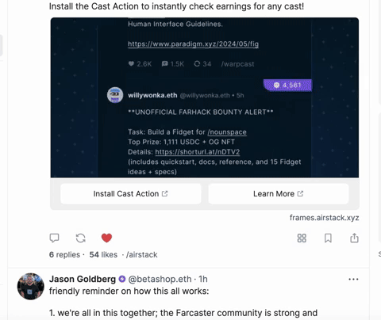

# 😶 Not A Token

\
[Not A Token](https://airstack.xyz/notatoken) is a points system that rewards the Farcaster community for creating great content and Farcaster developers for building great frames and apps. \

**‼️ Not A Token is being replaced with** [**Moxie Protocol**](https://moxie.xyz) **when it launches around 25 July.**&#x20;

Not A Token points earned from 10 July, 2024 until Moxie launches will not accrue any rewards.&#x20;

***

Here are some of the various ways to earn Not A Token:

* **Earn Not A Token for high quality casts and replies**&#x20;
  * You will automatically receive 1 NOTA for every 1 Social Capital Value your cast organically receives.&#x20;
  * Social Capital Value (SCV) is a metric created by Airstack that scores each Cast based on the influence of the Farcaster users who engaged with the cast. Learn more about SCV [here](https://docs.airstack.xyz/airstack-docs-and-faqs/abstractions/trending-casts/social-capital-value).&#x20;
  * Not A Token for Casts applies to all SCV earned from 1-May, 2024 onwards. Older casts can still earn SCV from new engagement, however SCV received by casts prior to 1-May 2024 does not carry over. \

  * [**Install the Airstack Cast Action on Warpcast**](https://warpcast.com/\~/add-cast-action?url=https%3A%2F%2Fframes.airstack.xyz%2Fne%2Faction) **to instantly check the NOTA earned on any Cast** \
    \
    \

  * **On Airstack,** the Purple banner with the 😶 on each Cast on Airstack indicates the amount of Not A Token earned for the cast. See [Trending Casts](https://airstack.xyz/trending-casts) as example. \
    \
    \

* **Earn Not A Token every time a unique Farcaster user uses your Frames** as a developer**.**&#x20;
  * You must use the [Airstack Frame Validator (free)](farcaster/farcaster-frames/frames-validator.md) in order for us to track and associate the usage.
  * Update 1 June, 2024: Not A Token earned from Frames = 25 per unique FID interacting with your Frame. \

